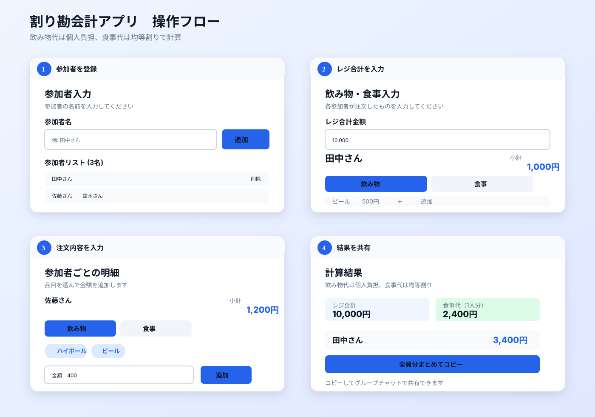

# 割り勘会計アプリ

飲み会や食事会の会計を、参加者ごとの飲み物代と全員で食べた食事代に分けて計算するWebアプリです。
参加者と注文内容、レジの合計金額を入力するだけで、それぞれの支払額を確認できます。



## こんなときに使えます

- 飲み会で、飲んだ量が人によって違うとき
- 食事会で、飲み物は個別・料理は均等に割り勘したいとき
- 会計後に、各参加者へ支払額をすぐ共有したいとき

## 主な機能

- 参加者の追加・削除
- 飲み物・食事の品目と金額の入力
- 税抜き価格・税込み価格の入力方式を選択
- 税抜き価格への消費税10%の自動適用
- レジ合計金額をもとにした自動計算
- 参加者ごとの結果コピー、全員分まとめてコピー
- 入力内容の同一タブ内での一時保存

## 使い方

### 1. 参加者を登録する

トップ画面の「始める」を押し、参加者の名前を入力して「追加」を押します。
全員を登録したら「次へ」を押してください。

### 2. レジ合計金額を入力する

「飲み物・食事入力」画面で、実際のレジ合計金額を入力します。

### 3. 注文内容を入力する

まず「税抜き価格」または「税込み価格」を選択します。税抜き価格を選ぶと、入力した金額に消費税10%を自動適用して表示・計算します。
その後、参加者ごとにカテゴリ（飲み物／食事）、品目、金額を入力して「追加」を押します。
よく使う品目はプリセットボタンから選択でき、「その他」から任意の品目名も入力できます。

### 4. 支払額を計算する

入力が終わったら「計算する」を押します。参加者ごとの支払額と内訳が表示されます。

### 5. 結果を共有する

「この人の結果をコピー」で個別の金額をコピーできます。
「全員分まとめてコピー」を使うと、参加者全員の支払額をまとめてコピーできます。

## 計算ルール

- 飲み物代は、注文した本人の個人負担です。
- 食事代は、レジ合計から全員分の飲み物代を引いた金額を参加者全員で均等に負担します。
- 食事代の1人分に端数が出た場合は四捨五入します。
- 税抜き入力では、品目ごとに消費税10%を加算し、1円未満を四捨五入します。

```text
食事代（1人分） = (レジ合計 - 飲み物代の合計) / 参加者数
各人の支払額 = その人の飲み物代 + 食事代（1人分）
```

たとえば、税抜き500円のビールを2杯入力した場合は、550円×2杯＝1,100円として計算します。

## データの保存について

入力内容はブラウザの`sessionStorage`に保存されます。同じタブであれば画面を移動・再読み込みしても入力内容を引き継げますが、別のタブや端末とは共有されません。

## 開発環境

- Next.js 15
- React 19
- TypeScript
- Tailwind CSS

## 起動方法

```bash
npm install
npm run dev
```

ブラウザで [http://localhost:3000](http://localhost:3000) を開いてください。

## テスト・ビルド

```bash
npm test
npm run build
npm run start
```

Vercelへのデプロイ手順は[DEPLOY.md](DEPLOY.md)を参照してください。
